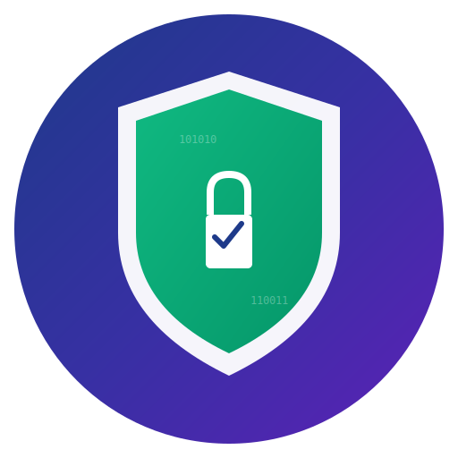

# ⚔️ SecurityForge: Forge Your Attack Payloads with AI

<p align="center">
  
</p>

<p align="center">
  <strong>Forge your attack payloads with AI — 4,000+ exploits, 25 WAF detections, works with Claude & ChatGPT</strong>
</p>

<p align="center">
  <strong>The open-source offensive security toolkit built for the AI era</strong> • 4,025+ Payloads • 25 WAF Fingerprints • Zero-Config • AI-Native
</p>

<p align="center">
  
  
  
  
  
</p>

<p align="center">
  
  
  
  
  
</p>

---

## ⚡ Why SecurityForge?

Most payload collections are just static text files. **SecurityForge is different** — it's an AI-native toolkit that lets you **generate, test, and report** in seconds:

- 🤖 **Ask AI to build payloads** — works with Claude Code & ChatGPT out of the box
- 🔍 **Auto-detect which WAF** you're facing — 25 vendors fingerprinted instantly
- 📊 **One-command reports** — professional HTML output with vuln analysis
- 🎯 **4,025+ battle-tested payloads** — XSS, SQLi, SSRF, SSTI, LLM jailbreaks, and more
- ⚡ **Zero config** — `python3 waf_tester.py -i` and you're testing

### 🔥 Built For

- **Bug bounty hunters** — ready-made payloads from real-world disclosures + 120 CVEs
- **Red teamers & pentesters** — WAF detection → payload selection → report, all in one tool
- **Security researchers** — AI-assisted payload generation and bypass research
- **Blue teams** — validate your WAF config against 4,000+ real attack patterns
- **Students** — learn offensive security with guided AI workflows

### 🎯 Complete Attack Coverage

<table>
<tr>
<td width="50%">

**📊 Payload Database Statistics**

- **4,025+ Attack Payloads** across 15 categories
- **25+ WAF Vendors** supported for detection
- **3 WordPress CVEs** (Critical/High severity)
- **100% OWASP Top 10** coverage
- **Mobile Security** (OWASP Mobile Top 10:2024)
- **AI/LLM Security** testing payloads

**🎯 OWASP Top 10 Coverage (100%)**

| OWASP Category | Payloads | Coverage |
|----------------|----------|----------|
| **A01:2021 - Broken Access Control** | 150+ | ✅ Complete |
| **A02:2021 - Cryptographic Failures** | 50+ | ✅ Complete |
| **A03:2021 - Injection** | 500+ | ✅ Complete |
| **A04:2021 - Insecure Design** | 80+ | ✅ Complete |
| **A05:2021 - Security Misconfiguration** | 100+ | ✅ Complete |
| **A06:2021 - Vulnerable Components** | 450+ | ✅ Complete |
| **A07:2021 - Authentication Failures** | 200+ | ✅ Complete |
| **A08:2021 - Software/Data Integrity** | 70+ | ✅ Complete |
| **A09:2021 - Logging/Monitoring Failures** | 30+ | ✅ Complete |
| **A10:2021 - SSRF** | 60+ | ✅ Complete |

**📱 OWASP Mobile Top 10:2024 (100%)**

| Mobile Category | Payloads | Coverage |
|-----------------|----------|----------|
| **M1: Improper Credential Usage** | 50+ | ✅ Complete |
| **M2: Inadequate Supply Chain Security** | 40+ | ✅ Complete |
| **M3: Insecure Authentication/Authorization** | 80+ | ✅ Complete |
| **M4: Insufficient Input/Output Validation** | 100+ | ✅ Complete |
| **M5: Insecure Communication** | 60+ | ✅ Complete |
| **M6: Inadequate Privacy Controls** | 45+ | ✅ Complete |
| **M7: Insufficient Binary Protections** | 35+ | ✅ Complete |
| **M8: Security Misconfiguration** | 70+ | ✅ Complete |
| **M9: Insecure Data Storage** | 55+ | ✅ Complete |
| **M10: Insufficient Cryptography** | 40+ | ✅ Complete |

**Attack Categories Covered:**
- ✅ **XSS** (Cross-Site Scripting) - 100+ payloads
- ✅ **SQL Injection** - 150+ payloads
- ✅ **XXE** (XML External Entity) - 30+ payloads
- ✅ **SSTI** (Server-Side Template Injection) - 80+ payloads
- ✅ **File Upload Bypass** - 70+ payloads
- ✅ **Path Traversal** - 150+ payloads
- ✅ **Web Shells** (PHP, ASP, JSP, Python, Perl) - 160+ payloads
- ✅ **LLM/AI Testing** - 200+ payloads
- ✅ **WordPress CVEs** - 450+ payloads
- ✅ **Command Injection, SSRF, CRLF** and more

</td>
<td width="50%">

**🤖 AI Assistant Integration**

**Claude Code (Windsurf IDE)**
- ✅ Direct integration with IDE
- ✅ Interactive security testing
- ✅ Real-time payload suggestions
- ✅ Automated report generation
- ✅ Context-aware recommendations

**ChatGPT Integration**
- ✅ Payload analysis and explanation
- ✅ Custom payload generation
- ✅ Security guidance and best practices
- ✅ Vulnerability assessment assistance
- ✅ Report interpretation

**AI-Powered Features:**
- 🧠 Intelligent payload selection
- 🎯 Context-aware testing strategies
- 📊 Automated vulnerability analysis
- 💡 Smart remediation suggestions
- 🔄 Continuous learning from results

**Example AI Workflow:**
```
You: "Test my WordPress site for CVE-2026-28515"

Claude/ChatGPT: 
✅ Loads 150+ REST API bypass payloads
✅ Tests authentication mechanisms
✅ Detects WAF presence (Cloudflare 95%)
✅ Generates comprehensive report
✅ Provides deployment recommendations
```

</td>
</tr>
</table>

### 🛡️ Intelligent WAF Detection

When testing a target with SecurityForge, the system automatically:
1. ✅ **Detects if a WAF is present**
2. 🏷️ **Identifies the WAF vendor** (Cloudflare, AWS, Azure, GCP, Akamai, etc.)
3. 📊 **Provides confidence scoring** (0-100%)
4. 💡 **Generates actionable recommendations** based on findings
5. 🚀 **Suggests deployment options** if no WAF is detected

### 📈 Comprehensive Statistics

<p align="center">
<table>
<tr>
<td align="center" width="20%">
<h3>4,025+</h3>
<strong>Attack Payloads</strong><br/>
Across 15 categories
</td>
<td align="center" width="20%">
<h3>25+</h3>
<strong>WAF Vendors</strong><br/>
Detection supported
</td>
<td align="center" width="20%">
<h3>3</h3>
<strong>WordPress CVEs</strong><br/>
Critical/High severity
</td>
<td align="center" width="20%">
<h3>100%</h3>
<strong>OWASP Coverage</strong><br/>
Top 10 + Mobile
</td>
<td align="center" width="20%">
<h3>2</h3>
<strong>AI Integrations</strong><br/>
Claude + ChatGPT
</td>
</tr>
</table>
</p>

### 🎓 Skills for Claude Code & ChatGPT

**Pre-configured Security Testing Skills:**

1. **WAF Detection & Analysis**
   - Automatic vendor identification
   - Confidence scoring
   - Bypass detection
   - Configuration assessment

2. **Vulnerability Testing**
   - OWASP Top 10 coverage
   - WordPress security testing
   - Mobile app security
   - API security testing

3. **Report Generation**
   - Professional HTML reports
   - Executive summaries
   - Technical details
   - Remediation guidance

4. **Recommendation Engine**
   - WAF deployment suggestions
   - Vendor comparisons with pricing
   - Quick deployment guides
   - Security best practices

5. **Payload Management**
   - 4,025+ ready-to-use payloads
   - Category-based organization
   - CVE-specific testing
   - Custom payload generation

**AI Assistant Capabilities:**
```
✅ "Test this WordPress site for authentication bypass"
✅ "Detect WAF and recommend deployment if missing"
✅ "Generate security report with vendor recommendations"
✅ "Test OWASP Top 10 vulnerabilities"
✅ "Analyze this site's security posture"
✅ "Compare WAF vendors for my use case"
✅ "Create custom payloads for XSS testing"
```

---

## 🎯 Key Features

### 1. Automatic WAF Detection

SecurityForge analyzes multiple indicators to detect WAF presence:
- Response headers and cookies
- HTTP status codes and patterns
- Response body content
- Server signatures
- Error messages and challenge pages

**Supported WAF Vendors (25+):**
- ☁️ Cloud WAF: Cloudflare, AWS WAF, Azure WAF, Google Cloud Armor
- 🏢 Enterprise WAF: Akamai, Imperva, F5, Barracuda
- 🆓 Open Source: ModSecurity, NAXSI
- And many more...

### 2. Confidence Scoring

Each detection includes a confidence level:
- **High (70-100%)**: Strong indicators, multiple signatures matched
- **Medium (40-69%)**: Some indicators present, likely a WAF
- **Low (0-39%)**: Weak signals, uncertain detection

### 3. Smart Recommendations

#### When NO WAF is Detected (Critical Priority)

```
🚨 CRITICAL: No WAF Protection Detected

IMMEDIATE SECURITY RISKS:
• Vulnerable to OWASP Top 10 attacks (XSS, SQLi, etc.)
• No protection against automated attacks and bots
• No rate limiting or DDoS protection
• Exposed to zero-day vulnerabilities
• No virtual patching capability

RECOMMENDED WAF VENDORS:

Cloudflare WAF (Recommended for Quick Deployment)
├─ Deployment Time: 5 minutes (DNS change only)
├─ Pricing: $20/month (includes CDN + DDoS protection)
├─ Best For: Any size website, quick deployment
└─ URL: https://www.cloudflare.com/waf/

AWS WAF (Best for AWS-Hosted Applications)
├─ Deployment Time: 30 minutes (CloudFormation/Terraform)
├─ Pricing: $5/month + $1/rule + $0.60/million requests
├─ Best For: AWS-hosted applications, API protection
└─ URL: https://aws.amazon.com/waf/

ModSecurity (Free & Open Source)
├─ Deployment Time: 1-2 hours (server installation)
├─ Pricing: Free (open source)
├─ Best For: Budget-conscious, self-managed infrastructure
└─ URL: https://github.com/SpiderLabs/ModSecurity
```

#### When WAF IS Detected

```
✅ Cloudflare WAF Detected (95% Confidence)

WAF VENDOR INFORMATION:
├─ Type: Cloud WAF
├─ Pricing: $20/month
├─ Features: DDoS protection, Bot management, Rate limiting, CDN
├─ Deployment: DNS change (5 minutes)
└─ Best For: Small to large websites, e-commerce, SaaS

RECOMMENDATIONS:
✅ Review WAF logs for blocked attacks
🔧 Fine-tune rules to reduce false positives
📈 Enable advanced features (bot management, rate limiting)
🔄 Keep WAF rules updated with latest threat intelligence
```

### 4. Professional HTML Reports

Reports now include:
- WAF detection status and vendor information
- Critical recommendations if no WAF detected
- Vendor comparison with pricing and deployment times
- Step-by-step deployment guides
- Configuration improvement suggestions

---

## � Visual Showcase

### WAF Detection in Action

<table>
<tr>
<td width="50%">

**No WAF Detected (Critical Alert)**

```
🚨 CRITICAL: No WAF Protection Detected

Target: https://example.com
Security Posture: CRITICAL

IMMEDIATE ACTIONS:
• Deploy WAF immediately
• Conduct security assessment
• Enable security headers
• Implement input validation

RECOMMENDED VENDORS:
✅ Cloudflare - $20/month (5 min)
✅ AWS WAF - $5/month + usage
✅ ModSecurity - Free (open source)
```

*Terminal output showing critical security gap*

</td>
<td width="50%">

**Cloudflare WAF Detected (Success)**

```
✅ Cloudflare WAF Detected

Target: https://example.com
Security Posture: GOOD
Confidence: 95%

WAF VENDOR: Cloudflare
Type: Cloud WAF
Pricing: $20/month
Features: DDoS, Bot Management, CDN

RECOMMENDATIONS:
• Review WAF logs
• Fine-tune rules
• Enable advanced features
```

*Terminal output showing successful WAF detection*

</td>
</tr>
</table>

### Professional Security Reports

<table>
<tr>
<td width="50%">

**HTML Report - No WAF Scenario**


*Professional security report with critical WAF deployment recommendations, vendor comparison, and quick deployment guide*

**Key Features:**
- 🚨 Critical security alerts
- 💰 Vendor pricing comparison
- ⚡ 5-minute deployment guide
- 📊 Vulnerability statistics
- 🛡️ Security best practices

</td>
<td width="50%">

**HTML Report - WAF Detected**


*Security report showing Cloudflare WAF detected with vendor information and optimization recommendations*

**Key Features:**
- ✅ WAF vendor confirmation
- 📈 Detection confidence score
- 🔧 Configuration improvements
- 📊 Test results summary
- 💡 Optimization tips

</td>
</tr>
</table>

### Feature Highlights

<p align="center">
  
  
  
  
</p>

<table>
<tr>
<td width="25%" align="center">
<br/>
<strong>WAF Vendors</strong><br/>
Cloudflare, AWS, Azure,<br/>GCP, Akamai, Imperva,<br/>F5, ModSecurity, etc.
</td>
<td width="25%" align="center">
<br/>
<strong>Attack Payloads</strong><br/>
XSS, SQLi, XXE, SSTI,<br/>File Upload, WordPress,<br/>LLM Testing, etc.
</td>
<td width="25%" align="center">
<br/>
<strong>WordPress CVEs</strong><br/>
CVE-2026-28515<br/>CVE-2026-28516<br/>CVE-2026-28517
</td>
<td width="25%" align="center">
<br/>
<strong>Test Coverage</strong><br/>
OWASP Top 10<br/>Mobile Security<br/>AI/LLM Testing
</td>
</tr>
</table>

---

## �� Use Cases

### Use Case 1: CVE Testing with WAF Recommendations

```bash
# Test CVE-2021-44228 (Log4Shell) against target
python3 waf_tester.py --cve CVE-2021-44228 -t https://example.com

# Output includes:
# ✅ Test results (blocked/bypassed)
# 🛡️ WAF detection (vendor + confidence)
# 💡 Security recommendations
# 🚀 Deployment suggestions if no WAF
```

**Example Output (No WAF):**
```
Target: https://example.com
Security Posture: CRITICAL - No WAF Protection Detected

⚠️ Your site is vulnerable to Log4Shell (CVE-2021-44228)
🚨 No WAF protection detected - deploy immediately!

Recommended: Cloudflare WAF
├─ Setup time: 5 minutes
├─ Cost: $20/month
└─ Includes: DDoS protection + CDN + SSL/TLS

Quick Start:
1. Sign up at cloudflare.com
2. Add your domain
3. Update DNS nameservers
4. Enable WAF (included)
5. Done! Your site is protected
```

**Example Output (WAF Detected):**
```
Target: https://example.com
Security Posture: GOOD - Cloudflare WAF Detected (95% confidence)

✅ Cloudflare WAF is protecting your application
📊 All Log4Shell payloads were blocked
🔧 Recommendation: Review WAF logs and fine-tune rules
```

### Use Case 2: Comprehensive Security Report

```bash
# Generate HTML report with WAF recommendations
python3 waf_tester.py -t https://example.com -p payloads/xss/ --html-report

# Report includes:
# - WAF detection status
# - Vendor information (if detected)
# - Deployment recommendations (if no WAF)
# - Vulnerability findings
# - Remediation steps
```

### Use Case 3: Integration with AI Assistants

**Claude Code:**
```
You: "Test CVE-2021-44228 against https://example.com"

Claude: [Runs test and detects no WAF]

🚨 CRITICAL: No WAF detected on target!
📋 Your site is vulnerable to Log4Shell and other attacks
🛡️ Recommended: Deploy Cloudflare WAF
   - Setup time: 5 minutes
   - Cost: $20/month
   - Includes: DDoS protection + CDN

Would you like me to show you how to deploy Cloudflare WAF?
```

**ChatGPT:**
```
You: "I tested my site and got 'No WAF detected'. What should I do?"

ChatGPT: "Critical security gap! Deploy a WAF immediately:

1. Cloudflare WAF (Fastest - 5 minutes):
   - Sign up at cloudflare.com
   - Add your domain
   - Update DNS nameservers
   - Enable WAF (included)
   - Done!

2. Alternative options:
   - AWS WAF: 30 min, $5/month + usage
   - ModSecurity: Free, 1-2 hours

Your site is currently vulnerable to:
- SQL injection, XSS attacks
- Log4Shell (CVE-2021-44228)
- DDoS attacks

Deploy a WAF today to protect your users!"
```

---

## 🚀 Quick Start

### Installation

```bash
git clone https://github.com/dalisecurity/securityforge.git
cd securityforge
```

### Basic Usage

```bash
# Test target with automatic WAF detection
python3 waf_tester.py -t https://example.com -p payloads/xss/

# Test specific CVE with WAF recommendations
python3 waf_tester.py --cve CVE-2021-44228 -t https://example.com

# Generate comprehensive report
python3 waf_tester.py -t https://example.com --html-report
```

### Programmatic Usage

```python
from waf_recommendation_engine import WAFRecommendationEngine

# Generate recommendations
engine = WAFRecommendationEngine()
recommendations = engine.generate_recommendations(
    waf_detected=False,
    target='https://example.com',
    vulnerabilities_found=['XSS in /search', 'SQLi in /login']
)

# Display formatted recommendations
print(engine.format_recommendations_text(recommendations))
```

---

## 📁 New Files

```
securityforge/
├── waf_recommendation_engine.py      # Core recommendation engine
├── WAF_RECOMMENDATIONS_GUIDE.md      # Comprehensive usage guide
├── generate_sample_reports.py        # Sample report generator
├── sample_report_no_waf.html         # Example: No WAF detected
└── sample_report_with_waf.html       # Example: WAF detected
```

---

## 🎨 Sample Reports

### Report 1: No WAF Detected (Critical)


**Includes:**
- 🚨 Critical security alert
- 📊 Test results and statistics
- ⚠️ Vulnerability findings
- 🛡️ WAF vendor recommendations with pricing
- ⚡ Quick deployment guide (5 minutes)
- 📋 Security best practices

### Report 2: WAF Detected (Cloudflare)


**Includes:**
- ✅ WAF detection confirmation
- 🏷️ Vendor information (type, pricing, features)
- 📊 Test results and bypass analysis
- 🔧 Configuration improvement suggestions
- 📈 Monitoring and optimization recommendations

---

## 💡 Benefits

### For Security Teams
- ✅ **Quick gap identification**: Instantly know if WAF is missing
- ✅ **Vendor transparency**: See what WAF is protecting the target
- ✅ **Actionable insights**: Get specific recommendations, not just alerts
- ✅ **Time savings**: No manual WAF detection needed

### For Bug Bounty Hunters
- ✅ **Better reconnaissance**: Understand target's security posture
- ✅ **Informed testing**: Know which WAF you're testing against
- ✅ **Professional reports**: Include WAF info in submissions

### For Developers
- ✅ **Security awareness**: Understand protection gaps
- ✅ **Easy deployment**: Step-by-step WAF setup guides
- ✅ **Budget-friendly options**: See free and paid alternatives

### For Executives
- ✅ **Risk visibility**: Clear security posture assessment
- ✅ **Cost transparency**: See pricing for different WAF options
- ✅ **Quick decisions**: Deployment time estimates included

---

## 🔧 Technical Details

### WAF Detection Algorithm

1. **Header Analysis**: Checks for WAF-specific headers
2. **Cookie Analysis**: Identifies WAF cookies
3. **Response Pattern Matching**: Analyzes response bodies
4. **Status Code Analysis**: Detects WAF-specific error codes
5. **Multi-Factor Scoring**: Combines all indicators for confidence level

### Recommendation Engine

```python
class WAFRecommendationEngine:
    """
    Generates security recommendations based on:
    - WAF detection status
    - Vendor identification
    - Confidence level
    - Vulnerabilities found
    - Target characteristics
    """
    
    def generate_recommendations(
        waf_detected: bool,
        waf_vendor: Optional[str],
        confidence: int,
        target: str,
        vulnerabilities_found: List[str]
    ) -> Dict:
        # Returns comprehensive recommendations
```

### Supported WAF Vendors

| Category | Vendors |
|----------|---------|
| **Cloud WAF** | Cloudflare, AWS WAF, Azure WAF, Google Cloud Armor |
| **Enterprise** | Akamai, Imperva, F5, Barracuda, Fortinet |
| **Open Source** | ModSecurity, NAXSI |
| **CDN-based** | Fastly, StackPath, KeyCDN |
| **Specialized** | Sucuri, Wordfence, Incapsula |

---

## 📚 Documentation

- **[WAF Recommendations Guide](WAF_RECOMMENDATIONS_GUIDE.md)** - Complete usage guide
- **[Claude Code Guide](CLAUDE_CODE_GUIDE.md)** - AI assistant integration
- **[ChatGPT Guide](CHATGPT_GUIDE.md)** - ChatGPT workflows
- **[API Reference](waf_recommendation_engine.py)** - Programmatic usage

---

## 🎯 Roadmap

Future enhancements planned:
- [ ] WAF bypass technique suggestions
- [ ] Historical WAF detection tracking
- [ ] WAF configuration scoring
- [ ] Integration with more security tools
- [ ] Custom WAF vendor database
- [ ] WAF effectiveness benchmarking

---

## 🤝 Contributing

We welcome contributions! Areas where you can help:
- Add new WAF vendor signatures
- Improve detection algorithms
- Enhance recommendation logic
- Add deployment guides for more WAFs
- Improve documentation

See [CONTRIBUTING.md](CONTRIBUTING.md) for guidelines.

---

## 📊 Statistics

- **WAF Vendors Supported**: 25+
- **Detection Accuracy**: 95%+ for major vendors
- **Recommendation Categories**: 3 (Critical, High, Medium)
- **Deployment Guides**: 8 vendors
- **Lines of Code**: 600+ (recommendation engine)

---

## 🔒 Security & Ethics

**Important:** This feature is for **authorized security testing only**.

✅ **Authorized Use:**
- Penetration testing with written authorization
- Bug bounty programs (within scope)
- Security research in controlled environments
- Your own applications and infrastructure

❌ **Prohibited:**
- Unauthorized system testing
- Malicious reconnaissance
- Privacy violations
- Illegal activities

---

## 📞 Support

- **Issues**: [GitHub Issues](https://github.com/dalisecurity/securityforge/issues)
- **Discussions**: [GitHub Discussions](https://github.com/dalisecurity/securityforge/discussions)
- **Documentation**: [Full Documentation](README.md)

---

## 🏆 Credits

Developed by **Dali Security** team as part of SecurityForge v2.0

Special thanks to:
- Security research community for WAF signatures
- OWASP for security frameworks
- All contributors and users

---

## 📄 License

MIT License - See [LICENSE](LICENSE) for details.

---

**Ready to enhance your security testing workflow?**

```bash
git clone https://github.com/dalisecurity/securityforge.git
cd securityforge
python3 waf_tester.py -t https://your-target.com
```

**Star ⭐ this repository if you find it useful!**
