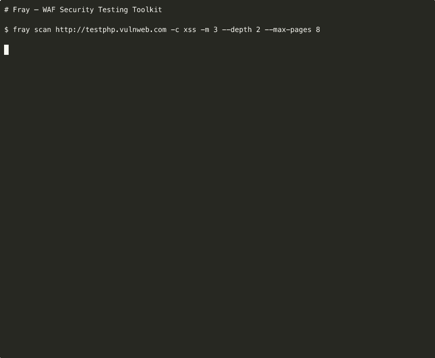

# Fray

**🌐 Language:** **English** | [日本語](README.ja.md)

### ⚔️ *Open-source WAF security testing toolkit — scan, detect, test, report*

[](https://github.com/dalisecurity/fray)
[](https://github.com/dalisecurity/fray)
[](https://github.com/dalisecurity/fray)
[](https://github.com/dalisecurity/fray)

[](https://pypi.org/project/fray/)
[](https://www.python.org/downloads/)
[](LICENSE)
[](https://github.com/dalisecurity/fray/stargazers)

> **FOR AUTHORIZED SECURITY TESTING ONLY** — Only test systems you own or have explicit written permission to test.

---

## Why Fray?

Most payload collections are static text files. Fray is a **complete workflow**:

- **`fray scan`** — Auto crawl → param discovery → payload injection (new)
- **`fray recon`** — 17 automated checks (TLS, headers, DNS, CORS, params, JS endpoints, historical URLs)
- **`fray detect`** — Fingerprint 25 WAF vendors
- **`fray test`** — 5,500+ payloads across 22 OWASP categories
- **`fray report`** — HTML & Markdown reports
- **Zero dependencies** — pure Python stdlib, `pip install fray` and go

---

## Quick Start

```bash
pip install fray
```

```bash
fray demo                                        # Try it now — WAF detect + XSS scan
fray scan https://example.com                    # Auto scan (crawl + inject)
fray recon https://example.com                   # Reconnaissance
fray test https://example.com --smart            # Smart payload testing
fray detect https://example.com                  # WAF detection
fray explain CVE-2021-44228                      # CVE intelligence
fray report -i results.json -o report.html       # Generate report
```

---

## Demo

`fray demo` detects the WAF, crawls the target, and injects XSS payloads. `↩ REFLECTED` = payload confirmed in response body. **Found 9 XSS bypasses in 28 seconds.**



---

## `fray scan` — Automated Attack Surface Mapping

One command: crawl your target, discover injection points, test payloads, report results.

```bash
fray scan https://example.com -c xss -m 3 -w 4
```

```
──────────────────── Crawling https://example.com ────────────────────
  [  1] https://example.com
  [  2] https://example.com/search
  [  3] https://example.com/guestbook.php
  ✓ Crawled 10 pages, found 7 injection points (3 forms, 1 JS endpoints)

──────────────────────── Payload Injection ───────────────────────────
  [1/7] POST /guestbook.php ?name= (form)
      BLOCKED   403 │ <script>alert(1)</script>
      PASSED    200 │     ↩ REFLECTED
  [2/7] GET  /search ?q= (form)
      BLOCKED   403 │ <script>alert(1)</script>
      PASSED    200 │     ↩ REFLECTED

╭──────────── Scan Summary ────────────╮
│ Total Tested      21                 │
│ Blocked           15  (71.4%)        │
│ Passed             6                 │
│ Reflected          4  ← confirmed    │
╰──────────────────────────────────────╯
```

Reflected payloads are highlighted with `↩ REFLECTED` — confirmed injection where the payload appears verbatim in the response body.

**What it does:**
1. **Crawls** — BFS spider, follows same-origin links, seeds from `robots.txt` + `sitemap.xml`
2. **Discovers** — Extracts params from URLs, HTML forms, and JavaScript API calls
3. **Injects** — Tests each parameter with payloads from your chosen category
4. **Detects reflection** — Confirms when payloads appear verbatim in the response body
5. **Auto-backoff** — Handles 429 rate limits with exponential backoff

```bash
# Scope-restricted scan (bug bounty)
fray scan https://target.com --scope scope.txt -w 4

# Authenticated scan with stealth
fray scan https://app.target.com --cookie "session=abc" --stealth

# Deep scan with SQLi payloads
fray scan https://target.com -c sqli --depth 5 --max-pages 100

# JSON output for CI pipelines
fray scan https://target.com --json -o results.json
```

[Full scan options + examples →](docs/scanning-guide.md)

---

## `fray recon` — 17 Automated Checks

```bash
fray recon https://example.com
fray recon https://example.com --js       # JS endpoint extraction
fray recon https://example.com --history  # Historical URL discovery
```

| Check | What It Finds |
|-------|---------------|
| **Parameter Discovery** | Query strings, form inputs, JS API endpoints |
| **JS Endpoint Extraction** | Hidden APIs, admin routes, GraphQL, auth endpoints from `.js` files |
| **Historical URLs** | Old endpoints via Wayback Machine, sitemap.xml, robots.txt |
| **TLS** | Version, cipher, cert expiry |
| **Security Headers** | HSTS, CSP, X-Frame-Options (scored) |
| **Cookies** | HttpOnly, Secure, SameSite flags |
| **Fingerprinting** | WordPress, PHP, Node.js, nginx, Apache, Java, .NET |
| **DNS** | A/CNAME/MX/TXT, CDN detection, SPF/DMARC |
| **CORS** | Wildcard, reflected origin, credentials misconfig |

Plus: 28 exposed file probes (`.env`, `.git`, phpinfo, actuator) · subdomains via crt.sh

`--js` parses inline and external JavaScript files for `fetch()`, `axios`, `XMLHttpRequest`, `/api/`, `/graphql`, `/admin/`, `/internal/` paths.

`--history` queries Wayback Machine CDX API, sitemap.xml, and robots.txt Disallow paths. Old endpoints often have weaker WAF rules.

[Recon guide →](docs/quickstart.md)

---

## `fray test --smart` — Adaptive Payload Selection

Runs recon first, then recommends payloads based on detected stack:

```bash
fray test https://example.com --smart
```

```
  Stack:   wordpress (100%), nginx (70%)

  Recommended:
    1. sqli            (1200 payloads)
    2. xss             (800 payloads)
    3. path_traversal  (400 payloads)

  [Y] Run recommended  [A] Run all  [N] Cancel  [1,3] Pick:
```

[OWASP coverage →](docs/owasp-complete-coverage.md)

---

## `fray detect` — 25 WAF Vendors

```bash
fray detect https://example.com
```

Cloudflare, AWS WAF, Akamai, Imperva, F5 BIG-IP, Fastly, Azure WAF, Google Cloud Armor, Sucuri, Fortinet, Wallarm, Vercel, and 13 more.

[Detection signatures →](docs/waf-detection-guide.md)

---

## Key Features

| Feature | How | Example |
|---------|-----|---------|
| **Scope Enforcement** | Restrict to permitted domains/IPs/CIDRs | `--scope scope.txt` |
| **Concurrent Scanning** | Parallelize crawl + injection (~3x faster) | `-w 4` |
| **Stealth Mode** | Randomized UA, jitter, throttle — one flag | `--stealth` |
| **Authenticated Scanning** | Cookie, Bearer, custom headers | `--cookie "session=abc"` |
| **CI/CD** | GitHub Actions with PR comments + fail-on-bypass | `fray ci init` |

[Auth guide →](docs/authentication-guide.md) · [Scan options →](docs/scanning-guide.md) · [CI guide →](docs/quickstart.md)

---

## 5,500+ Payloads · 22 Categories · 120 CVEs

| Category | Count | Category | Count |
|----------|-------|----------|-------|
| XSS | 867 | SSRF | 167 |
| SQLi | 456 | SSTI | 98 |
| Command Injection | 234 | XXE | 123 |
| Path Traversal | 189 | AI/LLM Prompt Injection | 370 |

```bash
fray explain log4shell    # CVE intelligence with payloads
fray payloads             # List all categories
```

[Payload database →](docs/payload-database-coverage.md) · [CVE coverage →](docs/cve-real-world-bypasses.md)

---

## MCP Server — AI Integration

```bash
pip install fray[mcp]
fray mcp
```

Ask Claude: *"What XSS payloads bypass Cloudflare?"* → calls Fray's MCP tools directly.

[Claude Code guide →](docs/claude-code-guide.md) · [ChatGPT guide →](docs/chatgpt-guide.md)

---

## Project Structure

```
fray/
├── fray/
│   ├── cli.py              # CLI entry point
│   ├── scanner.py           # Auto scan: crawl → inject
│   ├── recon.py             # 14-check reconnaissance
│   ├── detector.py          # WAF detection (25 vendors)
│   ├── tester.py            # Payload testing engine
│   ├── reporter.py          # HTML + Markdown reports
│   ├── mcp_server.py        # MCP server for AI assistants
│   └── payloads/            # 5,500+ payloads (22 categories)
├── tests/                   # 624 tests
├── docs/                    # 30 guides
└── pyproject.toml           # pip install fray
```

---

## Roadmap

- [x] Auto scan: crawl → discover → inject (`fray scan`)
- [x] Reflected payload detection (confirmed injection)
- [x] Scope file enforcement + concurrent workers
- [x] 14-check reconnaissance, smart mode, WAF detection
- [x] HTML/Markdown reports, MCP server
- [ ] HackerOne API integration (auto-submit findings)
- [ ] Web-based report dashboard
- [ ] ML-based payload effectiveness scoring

---

## Contributing

See [CONTRIBUTING.md](CONTRIBUTING.md).

## Legal

**MIT License** — See [LICENSE](LICENSE). Only test systems you own or have explicit authorization to test.

**Security issues:** soc@dalisec.io · [SECURITY.md](SECURITY.md)

---

**[📖 All Documentation (30 guides)](docs/) · [PyPI](https://pypi.org/project/fray/) · [Issues](https://github.com/dalisecurity/fray/issues) · [Discussions](https://github.com/dalisecurity/fray/discussions)**
