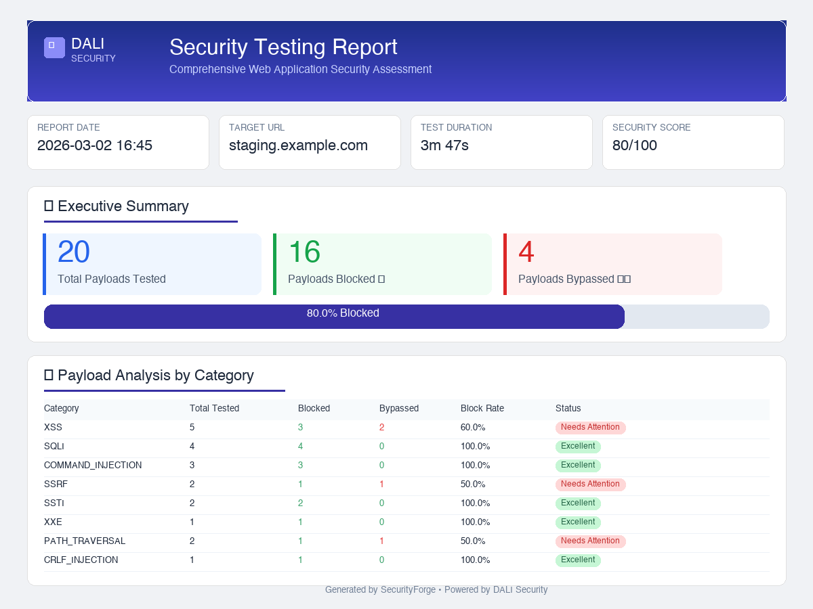

# Fray

### ⚔️ *Open-source WAF security testing toolkit — recon, detect, test, report*

[](https://github.com/dalisecurity/fray)
[](https://github.com/dalisecurity/fray)
[](https://github.com/dalisecurity/fray)
[](https://github.com/dalisecurity/fray)

[](https://pypi.org/project/fray/)
[](https://www.python.org/downloads/)
[](LICENSE)
[](https://github.com/dalisecurity/fray/stargazers)

> ⚠️ **FOR AUTHORIZED SECURITY TESTING ONLY** — Only test systems you own or have explicit written permission to test.

---

## Why Fray?

Most payload collections are static text files. Fray is a **complete workflow** — recon → detect → test → report:

- 🔍 **Recon first** — 14 checks: TLS, headers, cookies, DNS, CORS, exposed files, subdomains
- 🎯 **Smart testing** — detects WordPress? Recommends sqli + xss payloads. You pick Y/N
- 🛡️ **WAF detection** — fingerprints 25 vendors (Cloudflare, AWS, Akamai, Imperva, etc.)
- 🐛 **HackerOne ready** — structured JSON output maps to HackerOne severity/weakness taxonomy
- 🤖 **AI-native** — MCP server for Claude Code & ChatGPT integration
- 📊 **One-command reports** — HTML & Markdown with vulnerability analysis
- ⚡ **Zero dependencies** — pure Python stdlib, `pip install fray` and go

| OWASP Framework | Payloads | Coverage |
|----------------|----------|----------|
| **Web Top 10:2021** | 1,690+ | ✅ 100% |
| **Mobile Top 10:2024** | 575+ | ✅ 100% |
| **LLM Top 10** (AI/ML) | 300+ | ✅ 100% |
| **API Security Top 10** | 520+ | ✅ 100% |

---

## Quick Start

```bash
pip install fray
```

```bash
# 1. Recon — know your target before testing
fray recon https://example.com

# 2. Smart mode — recon + pick payloads interactively
fray test https://example.com --smart

# 3. Detect WAF vendor
fray detect https://example.com

# 4. Test specific category
fray test https://example.com -c xss --max 10

# 5. Generate report
fray report -i results.json -o report.html
```

---

## 🔍 Reconnaissance — `fray recon`

14 automated checks in a single command:

```bash
fray recon https://example.com
```

| Check | What It Finds |
|-------|---------------|
| **TLS** | Version, cipher, cert expiry, TLS 1.0/1.1 |
| **Security Headers** | HSTS, CSP, X-Frame-Options + 6 more (scored) |
| **Cookies** | HttpOnly, Secure, SameSite flags (scored) |
| **Fingerprinting** | WordPress, Drupal, PHP, Node.js, React, nginx, Apache, Java, .NET + more |
| **DNS** | A/AAAA/CNAME/MX/TXT/NS, CDN detection, SPF/DMARC |
| **robots.txt** | Disallowed paths, interesting endpoints (admin, api, login) |
| **CORS** | Wildcard origin, reflected origin, credentials misconfig |
| **Exposed Files** | 28 probes — `.env`, `.git`, phpinfo, actuator, SQL dumps |
| **HTTP Methods** | Dangerous methods: PUT, DELETE, TRACE |
| **Error Page** | Stack traces, version leaks, framework hints from 404 |
| **Subdomains** | crt.sh certificate transparency enumeration |

```bash
fray recon https://example.com --json       # Raw JSON
fray recon https://example.com -o recon.json # Save to file
```

> 📖 For more details, see [docs/quickstart.md](docs/quickstart.md)

---

## 🎯 Smart Mode — `fray test --smart`

Recon runs first, then recommends payloads based on what it finds:

```
🔍 Running reconnaissance on https://example.com...

───────────────────────────────────────────────────
  Target:  https://example.com
  TLS:     TLSv1.3
  Headers: 67%
  Stack:   wordpress (100%), nginx (70%)
───────────────────────────────────────────────────

  Recommended categories (based on detected stack):

    1. sqli                      (1200 payloads)
    2. xss                       (800 payloads)
    3. path_traversal            (400 payloads)

    Total: 2400 payloads (vs 5500 if all categories)

  [Y] Run recommended  [A] Run all  [N] Cancel  [1,3] Pick:
```

| Input | Action |
|-------|--------|
| **Y** | Run recommended categories |
| **A** | Run all categories |
| **N** | Cancel |
| **1,3** | Pick specific categories |

```bash
fray test https://example.com --smart -y    # Auto-accept (CI/scripts)
```

**Tech → Payload mapping:**

| Detected | Priority Payloads |
|----------|-------------------|
| WordPress | sqli, xss, path_traversal, command_injection, ssrf |
| Drupal | sqli, ssti, xss, command_injection |
| PHP | sqli, path_traversal, command_injection, file_upload |
| Node.js | ssti, ssrf, xss, command_injection |
| Java | ssti, xxe, sqli, command_injection |
| .NET | sqli, path_traversal, xxe, command_injection |

> 📖 See full OWASP coverage at [docs/owasp-complete-coverage.md](docs/owasp-complete-coverage.md)

---

## 🛡️ WAF Detection — 25 Vendors

```bash
fray detect https://example.com
```

Detects: **Cloudflare, AWS WAF, Akamai, Imperva, F5 BIG-IP, Fastly, Azure WAF, Google Cloud Armor, Sucuri, Fortinet, Wallarm, Vercel** and 13 more.

[Full vendor table + detection signatures →](docs/waf-detection-guide.md) · [WAF research →](docs/waf-detection-research.md)

---

## 🐛 Bug Bounty Integration

Fray is built for bug bounty workflows — from recon to report submission:

### HackerOne

Fray's JSON output aligns with HackerOne's vulnerability taxonomy:

```bash
# Full workflow: recon → smart test → report
fray recon https://target.hackerone.com -o recon.json
fray test https://target.hackerone.com --smart -y -o results.json
fray report -i results.json -o report.html --format markdown
```

- **Recon findings** map to HackerOne weakness types (Misconfiguration, Information Disclosure, etc.)
- **Exposed files** → Information Disclosure findings
- **Missing headers / cookie flags** → Security Misconfiguration
- **CORS misconfig** → CORS Misconfiguration weakness
- **Markdown reports** paste directly into HackerOne report fields

### Supported Platforms

| Platform | How Fray Helps |
|----------|---------------|
| **HackerOne** | Structured findings, markdown reports, weakness taxonomy alignment |
| **Bugcrowd** | JSON output feeds into submission templates |
| **Intigriti** | Recon → test → report workflow |
| **YesWeHack** | Severity mapping from recon scores |

### Workflow Example

```
1. fray recon https://target.com         → Discover attack surface
2. fray detect https://target.com        → Know which WAF you're facing
3. fray test https://target.com --smart  → Test with prioritized payloads
4. fray report -i results.json           → Generate submission-ready report
```

---

## 🤖 MCP Server — AI Integration

```bash
pip install fray[mcp]
fray mcp
```

Add to Claude Desktop config (`~/Library/Application Support/Claude/claude_desktop_config.json`):

```json
{
  "mcpServers": {
    "fray": { "command": "python", "args": ["-m", "fray.mcp_server"] }
  }
}
```

**6 tools:** `list_payload_categories`, `get_payloads`, `search_payloads`, `get_waf_signatures`, `get_cve_details`, `suggest_payloads_for_waf`

Ask Claude: *"What XSS payloads bypass Cloudflare?"* → it calls the MCP tools directly.

[Claude Code guide →](docs/claude-code-guide.md) · [ChatGPT guide →](docs/chatgpt-guide.md)

---

## 📊 Reports

```bash
fray report --sample                           # Demo report
fray report -i results.json -o report.html     # HTML report
fray report -i results.json --format markdown  # Markdown report
```



[Report guide →](docs/report-guide.md) · [POC simulation guide →](docs/poc-simulation-guide.md)

---

## 📦 5,500+ Payloads

```bash
fray payloads  # List all categories
```

| Category | Payloads | Category | Payloads |
|----------|----------|----------|----------|
| XSS | 867 | SSRF | 167 |
| SQLi | 456 | SSTI | 98 |
| Command Injection | 234 | XXE | 123 |
| Path Traversal | 189 | File Upload | 70+ |
| AI/LLM Prompt Injection | 370 | Web Shells | 160+ |
| OWASP Mobile | 575+ | CVE Exploits | 220 |

Includes **120 real-world CVEs** (2020–2026): Log4Shell, Spring4Shell, ProxyShell, and more.

[Full payload database →](docs/payload-database-coverage.md) · [CVE coverage →](docs/cve-real-world-bypasses.md) · [AI security →](docs/ai-security-guide.md) · [Mobile security →](docs/owasp-mobile-top10.md) · [API security →](docs/owasp-api-security.md)

---

## 🏗️ Project Structure

```
fray/
├── fray/
│   ├── cli.py              # CLI entry point
│   ├── recon.py             # 14-check reconnaissance engine
│   ├── detector.py          # WAF detection (25 vendors)
│   ├── tester.py            # Payload testing engine
│   ├── evolve.py            # Adaptive payload evolution
│   ├── reporter.py          # HTML + Markdown reports
│   ├── mcp_server.py        # MCP server for AI assistants
│   └── payloads/            # 5,500+ payloads (22 categories)
├── tests/                   # 330 tests
├── docs/                    # 28 guides
└── pyproject.toml           # pip install fray
```

---

## 📈 Roadmap

**Done:**
- [x] 14-check reconnaissance (`fray recon`)
- [x] Smart payload selection with interactive prompt (`--smart`)
- [x] Cookie, CORS, exposed file, DNS, subdomain scanning
- [x] Adaptive payload evolution
- [x] HTML + Markdown report generation
- [x] MCP server for AI integration

**Next:**
- [ ] Shareable report URLs (hosted HTML, temporary links)
- [ ] HackerOne API integration (auto-submit findings)
- [ ] Web-based report dashboard
- [ ] ML-based payload effectiveness scoring
- [ ] Multi-WAF comparison testing

---

## Contributing

See [CONTRIBUTING.md](CONTRIBUTING.md). We welcome payload contributions, tool improvements, and documentation PRs.

## Legal

**MIT License** — See [LICENSE](LICENSE). Only test systems you own or have explicit authorization to test. The authors are not responsible for misuse.

**Security issues:** soc@dalisec.io · [SECURITY.md](SECURITY.md)

---

**[📖 All Documentation (28 guides)](docs/) · [PyPI](https://pypi.org/project/fray/) · [Issues](https://github.com/dalisecurity/fray/issues) · [Discussions](https://github.com/dalisecurity/fray/discussions)**
